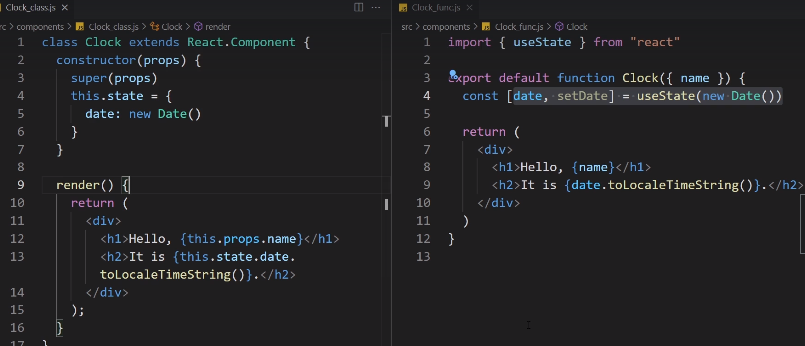

Props: way in react to pass data from parent component down to a child comp. could be any kind of data. Like the app comp can pass the title prop ( as a string) to title comp, which can then display the title. This way, after making a Title component, we can pass it in different parts of our application.

Portals: Way to take a comp and render it somewhere in DOM outside the scope of the parent ele. for eg we are rendering the modal in App comp, but ith portal we can render it outside of it.

Class components: older way of making comps

## Styles
### Global Styles : index.css
Heading, paragraph, btn

### Component Styles : app.css, modal.css
NOTE: Component specific style sheets are also global; The styles will be inserted into a style tag in the main html page in head tag. Therefore only style the component inside a comp style sheet. for eg if you need to style modal's h2, use a root class (.modal h2).

### Inline styles: directly on jsx
need to be in a js obj, so 2 curly braces {{}}, 1 for dynamic value in jsx, 1 for js obj

### CSS modules : 
Automatically scope css rules to only apply to specific comp, and not globally