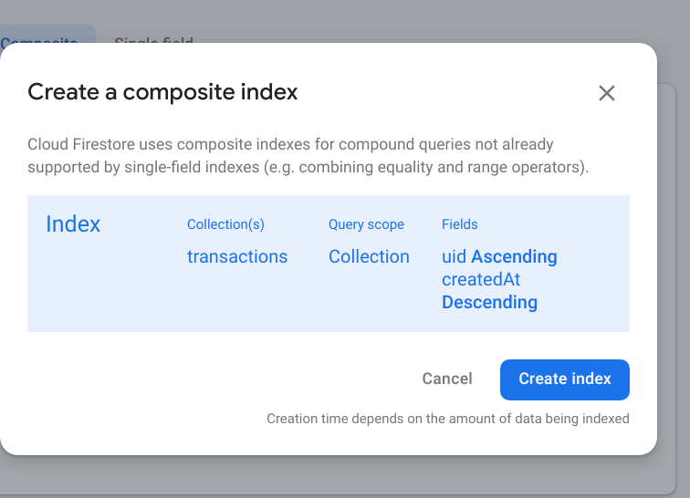

# Transaction Tracker
https://mymoney-7fe48.web.app/

<br>
<br>

## Firebase Auth

Firebase creates a JWT for the user. its sent back to the browser along with info abt the user, which we can then access from our react app. Then for every req sent to firebase, that jwt is also sent along.

### NOTE: Read comments in useLogout and AuthContext (doubt also there)

### useState vs useReducer

https://dev.to/spukas/3-reasons-to-usereducer-over-usestate-43ad

### Firestore indexes (SEE MORE)

when 1st using queries (where, orderBy), there'll be an error. Upon clicking on the err link, it will say you need to create indexes.



## Firebase CLI

```
firebase login
```

In project directory,

```
firebase init
```

Do select firestore and hosting : configure files.. ones

Change public directory folder name to build

Dont setup automatic deploys with github

To deploy firestore rules

```
firebase deploy --only firestore
```

## Deploy

```
npm run build

```

Now deploy build folder to firebase

```
firebase deploy
```

To rebuild, again npm run build and firebase deploy
