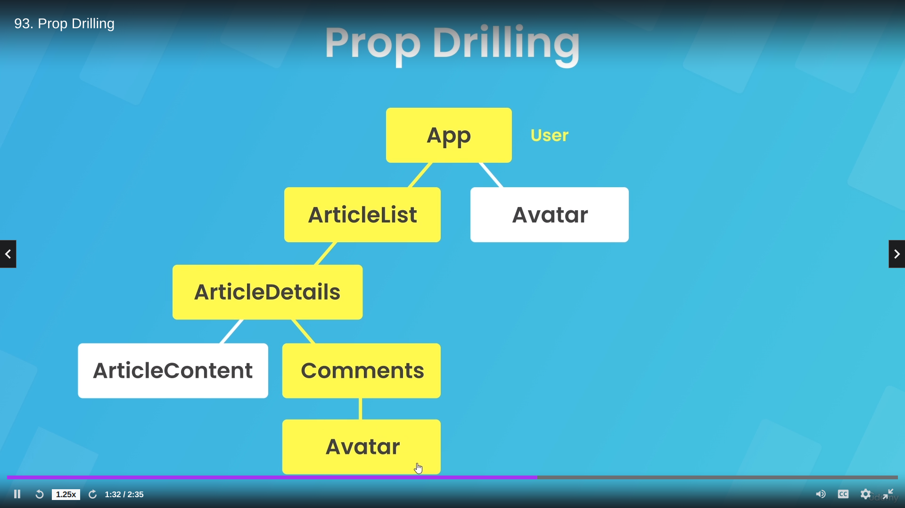
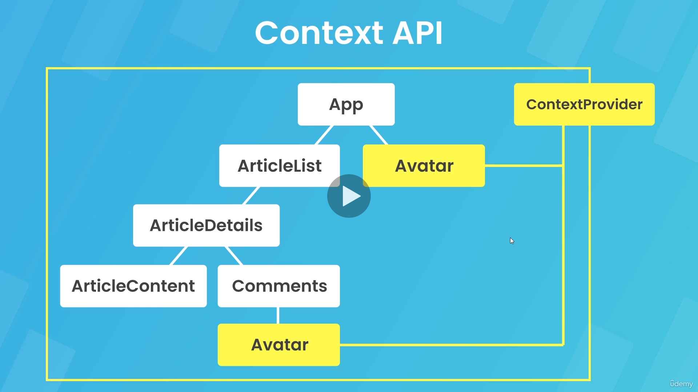

# 11th module

note for earlier chapters: useState is not async, the setVariable fn returned from useState is async..  (see more abt hooks)

## useFetch working here:
when we do `useFetch(url, 'POST')`, inside useFetch, the options is not yet set (async) so when useEffect runs for the 1st time, nothing will happen (empty states of data, error, are returned from useFetch). When in other place we then run postData(options), options state made in useFetch is now set, so useEffect runs again (options is in dependency array), now method (as already supplied earlier) is POST and options is set, so fetchData(options will run).

# 12th module

## Context api

suppose we have a user. We can store its logged in state in variable but if a component needs (for eg. Avatar) it, we'll have to pass it thru all parent comps as prop, known as prop drilling (drilling a hole in all comps just to pass a prop).

Solution: to make a global state using React Context, helps in some cases.
Context gives a store of shared data. That context can be applied to any comp tree

Context can surround the whole comp tree, or can just wrap a smaller subset as well. We dont actually wrap the context itself, we wrap a context provider component.

But we shouldnt always use context api for global state as using a lot of global states can lead to unnecessary comp re-renders (any comp that consumes the context will re render when any data in context changes)

## Reducers

When we want to update the context value, we can do so by making the value a state using useState hook, and then when we change the state, the comp where its used re renders. But there can be complex and many states, and updating one or multiple of them (for eg modifying an array in different ways) can bloat component code.

We can use a reducer fn to combat this, a single fn having all logic we'll need to update state values